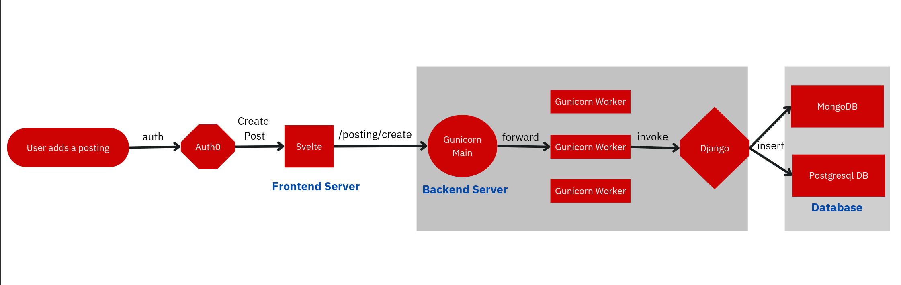

# UMass UnBoxed

The (U)Mass (U)nBoxed mission is simple: foster our community's growth and make resources accessible for all.
View a live version of [UMass UnBoxed](http://umassunboxed.tech).

Our platform is committed to providing a secure, fun, and safe way to ensure that each UMass student can buy and sell goods exclusively inside the UMASS community! :)

Winner of Best Web Hack at HackUMass

## Concept

The project was built on top of a MSAPD stack(Mongo, Svelte, Auth0, Postgres, Django).

1. Store Posting and User information through Postgresql
2. Handle Image Data and Document-based User Metadata through MongoDB Atlas
3. Enable SSO authentication through Auth0
4. Scaling API served through Django Web Framework with Gunicorn Workers
5. Frontend developed with Svelte hosted through PM2.
6. Deployed frontend and backend microservices on AWS EC2

## Demo

### Landing Page

### Home Page

### Listing Page

### Posting Page

## Tech Stack

